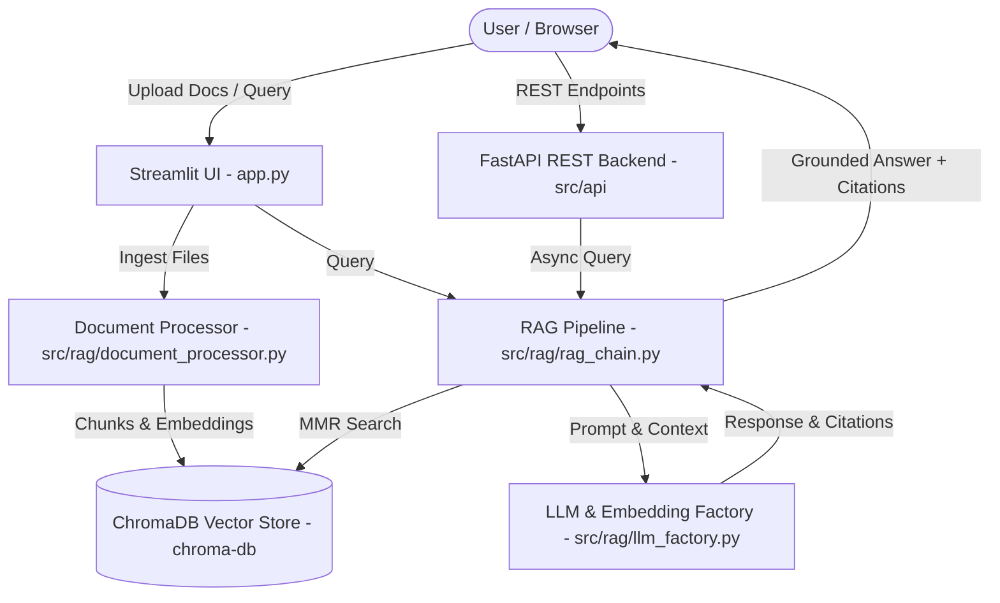

# 📚 Enterprise RAG Document Intelligence Platform

[](https://www.python.org/)
[](https://fastapi.tiangolo.com/)
[](https://www.langchain.com/)
[](https://streamlit.io/)
[](https://www.trychroma.com/)
[](https://www.docker.com/)

A modular, production-grade **Retrieval-Augmented Generation (RAG)** platform for high-precision document question-answering with exact source citations. Powered by **LangChain**, **FastAPI**, **ChromaDB**, and **Streamlit**.

---

## 🌟 Key Features

- **📄 Multi-Format Ingestion**: Process PDF, TXT, and Markdown files with recursive text chunking and dynamic metadata enrichment (chunk IDs, source names, page numbers, UTC timestamps).
- **🎯 High-Precision MMR Search**: Persistent **ChromaDB** vector storage leveraging **Maximal Marginal Relevance (MMR)** to minimize context redundancy and maximize diversity.
- **🤖 Multi-Provider LLM & Embedding Factory**: Seamlessly switch between **Mistral AI**, **OpenAI (GPT-4o)**, **Google Gemini**, and local free **HuggingFace (`all-MiniLM-L6-v2`)** embeddings with zero-downtime fallback.
- **⚡ Async REST API Backend**: Built with **FastAPI**, featuring asynchronous document uploading, list management, and token streaming via Server-Sent Events (SSE).
- **🎨 Glassmorphism Production UI**: Polished **Streamlit** dashboard featuring chat history, document ingestion controls, live knowledge base metrics, and expandable source citations.
- **🐳 DevOps & Containerization**: Fully containerized using multi-stage **Dockerfile** and **Docker Compose** with persistent storage volume mounts.
- **🧪 Automated Test Suite**: Built-in integration and unit tests covering document processing, vector storage, and RAG pipelines using **Pytest**.

---

## 🏗️ Architecture Workflow



---

## 📂 Project Structure

```
RAG_Project/
├── src/
│   ├── api/
│   │   ├── main.py             # FastAPI Application & Endpoints
│   │   └── schemas.py          # Pydantic Request/Response Models
│   ├── core/
│   │   ├── config.py           # Centralized Pydantic Settings
│   │   └── logger.py           # Structured Loguru Logging
│   └── rag/
│       ├── document_processor.py# Ingestion & Chunking Logic
│       ├── llm_factory.py      # Multi-Provider Factory (Mistral/OpenAI/Gemini/HuggingFace)
│       ├── rag_chain.py        # RAG Execution Engine & Prompt Formatting
│       └── vector_store.py     # Persistent ChromaDB Manager
├── tests/
│   ├── __init__.py
│   └── test_rag.py             # Pytest Suite
├── .streamlit/
│   └── config.toml             # Streamlit Production Theme & Configuration
├── app.py                      # Production Streamlit UI Dashboard
├── Dockerfile                  # Production Multi-Stage Container Setup
├── docker-compose.yml          # Container Orchestration
├── requirements.txt            # Locked Dependencies List
├── .env.example                # Environment Variable Template
└── .gitignore                  # Git Exclusion Rules
```

---

## 🚀 Quick Start Guide

### 1. Prerequisites
- Python 3.11+
- Git

### 2. Installation & Setup

1. **Clone the Repository**:
   ```bash
   git clone https://github.com/YOUR_USERNAME/RAG_Project.git
   cd RAG_Project
   ```

2. **Set Up Environment Variables**:
   Copy `.env.example` to `.env` and fill in your API keys:
   ```bash
   cp .env.example .env
   ```
   *Edit `.env`*:
   ```env
   MISTRAL_API_KEY=your_mistral_api_key_here
   OPENAI_API_KEY=your_openai_api_key_here
   GOOGLE_API_KEY=your_google_api_key_here
   ```

3. **Install Dependencies**:
   ```bash
   python -m pip install -r requirements.txt
   ```

---

## 🖥️ Running the Application

### Option A: Launch Streamlit Web App (Recommended)
```bash
python -m streamlit run app.py
```
Access the UI at: **`http://localhost:8501`**

### Option B: Launch FastAPI REST API Backend
```bash
python -m uvicorn src.api.main:app --reload --port 8000
```
Access Interactive Swagger API Docs at: **`http://localhost:8000/docs`**

### Option C: Run Full Stack via Docker Compose
```bash
docker-compose up --build
```
- **Streamlit UI**: `http://localhost:8501`
- **FastAPI API**: `http://localhost:8000`

---

## 📡 REST API Documentation

| Endpoint | Method | Description |
| :--- | :--- | :--- |
| `/api/v1/health` | `GET` | System health check and database metrics |
| `/api/v1/documents/upload` | `POST` | Upload and index PDF, TXT, or MD documents |
| `/api/v1/documents` | `GET` | List all ingested document sources |
| `/api/v1/documents/{source_name}` | `DELETE` | Delete all vectors associated with a document |
| `/api/v1/chat` | `POST` | Execute RAG query and receive answer with citations |
| `/api/v1/chat/stream` | `POST` | Real-time token streaming endpoint |

---

## 🧪 Running Automated Tests

Run the test suite using **Pytest**:
```bash
python -m pytest tests/test_rag.py -v
```

---

## 🔒 Security Notice

Never commit your `.env` file containing actual private API keys to GitHub. The included `.gitignore` automatically excludes `.env`, `.venv`, and `chroma-db/`.

---

## 📜 License

Distributed under the MIT License. See `LICENSE` for more information.
